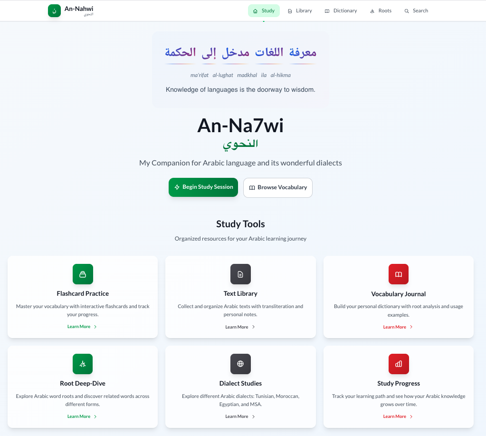
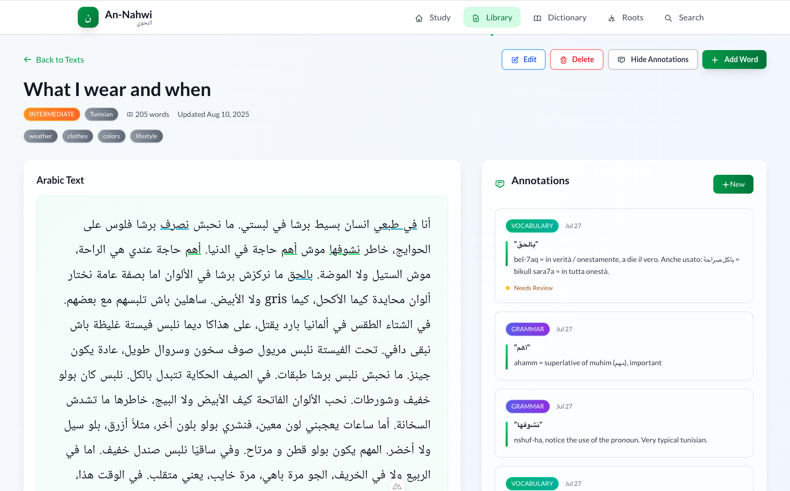
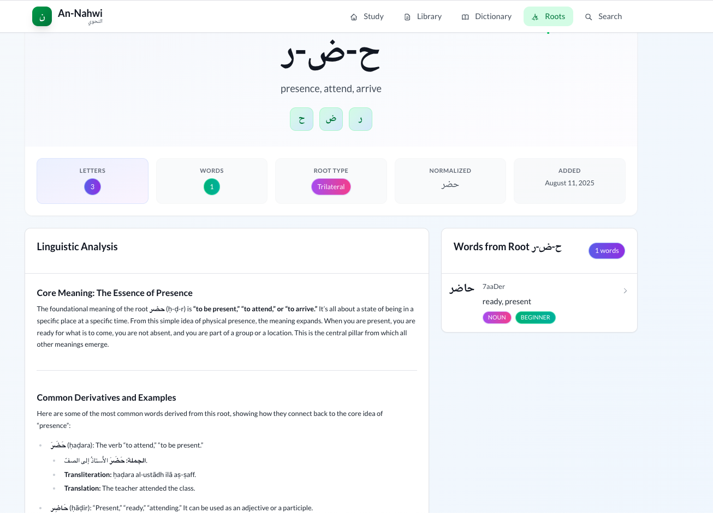
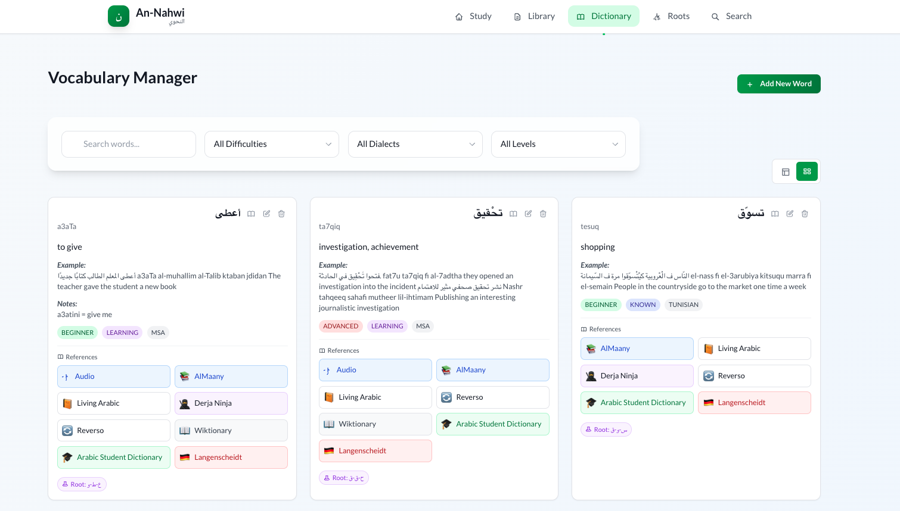
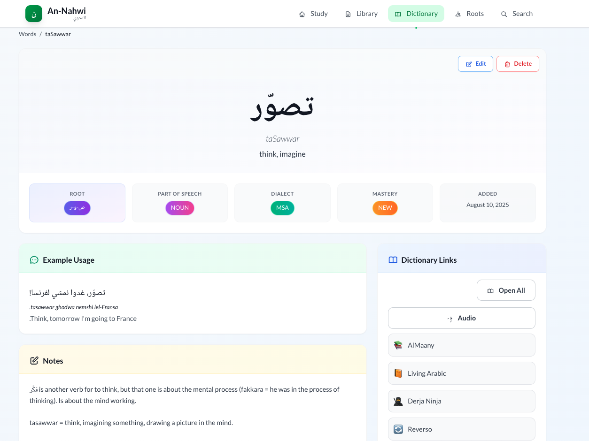
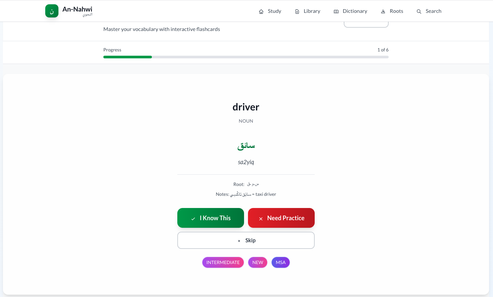
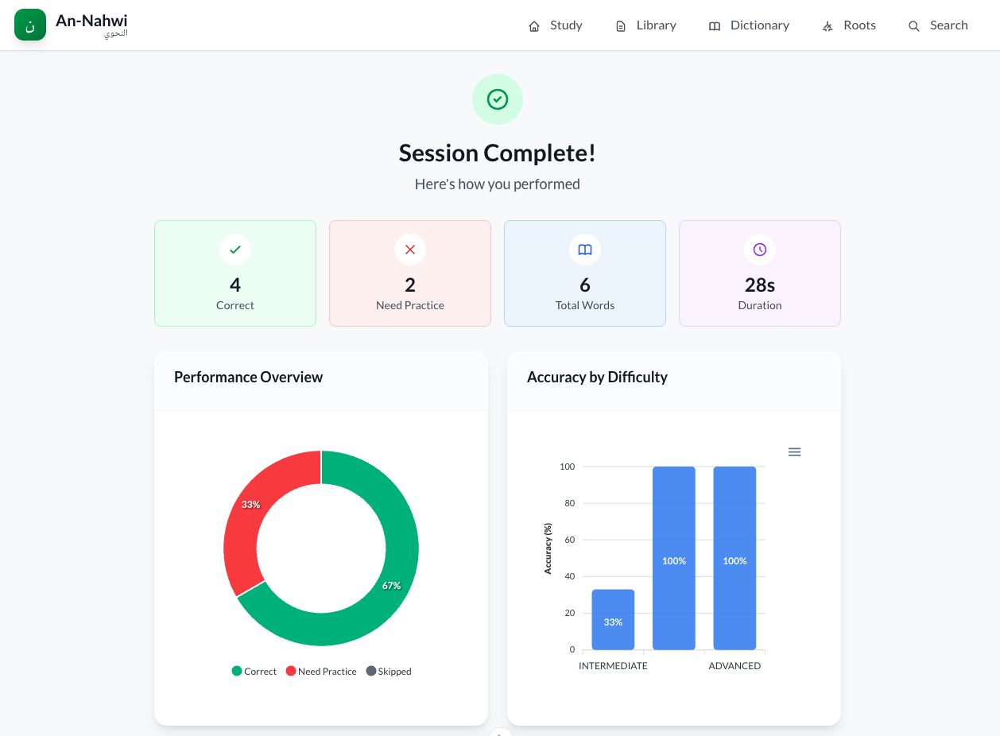
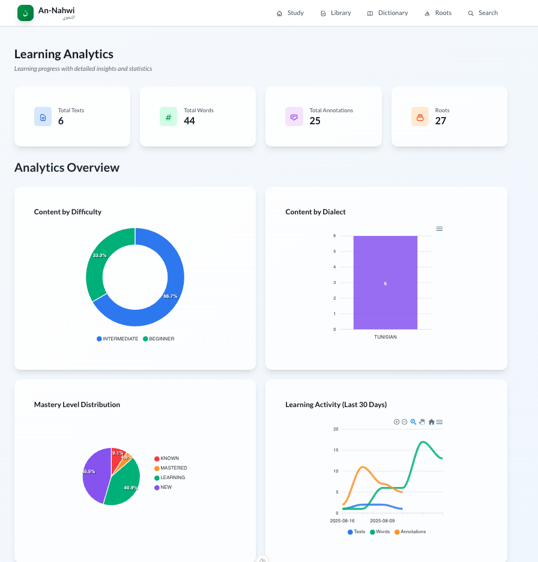

# An-Nahwi Features Gallery

This page showcases the main features and user interface of An-Nahwi, the Arabic learning application.

## Homepage & Navigation

The main dashboard provides quick access to all learning tools and shows your progress overview.

## Text Management

## Root Management

Browse and explore Arabic roots with their associated vocabulary and meanings.

Detailed view of Arabic roots showing related words, patterns, and linguistic information.

## Vocabulary Management

Comprehensive vocabulary management system with search and filtering capabilities.

Detailed word information including translations, root analysis, and usage examples.

## Interactive Learning

Interactive flashcard system for vocabulary learning with spaced repetition.

Session results showing your performance and progress tracking.

## Analytics & Progress

Comprehensive analytics dashboard to track your learning progress over time.

[← Back to README](../README.md)
